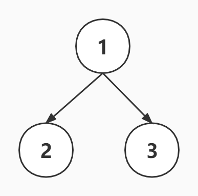
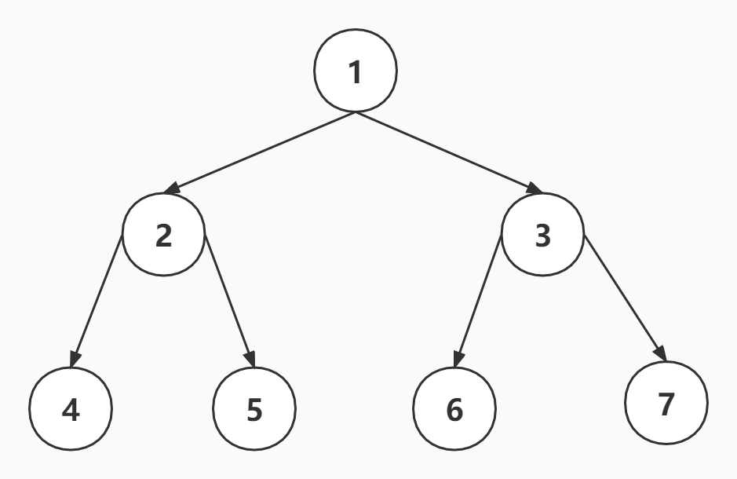
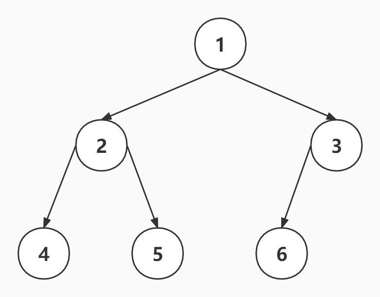

### Scheduler

#### 最小堆

- 最小堆是一种**经过排序**的完全二叉树
- 其中任一非终端节点的数据值均不大于其左子节点和右子节点的值
- 根结点值是所有堆结点值中最小者
- 编号关系
  - 左子节点编号=父节点编号\*2
  - 右子节点编号=左子节点编号+1
  - 父节点编号=子节点编号除以 2 取整
- 索引关系
  - 左子节点索引=(父节点索引+1)\*2-1
  - 右子节点索引=左子节点索引+1
  - 父节点索引=(子节点索引-1)/2


#### 二叉树

- 每个节点最多有两个子节点



#### 满二叉树

- 除最后一层无任何子节点外，每一层上的所有结点都有两个子结点的二叉树



#### 完全二叉树

- 叶子结点只能出现在最下层和次下层
- 且最下层的叶子结点集中在树的左部



#### MessageChannel

- 目前 `requestIdleCallback` 浏览器的兼容性不好
- 所以 React 利用 [MessageChannel](https://developer.mozilla.org/zh-CN/docs/Web/API/MessageChannel "MessageChannel") 模拟了 requestIdleCallback，将回调延迟到绘制操作之后执行
- MessageChannel API 允许我们创建一个新的消息通道，并通过它的两个 MessagePort 属性发送数据
- MessageChannel 创建了一个通信的管道，这个管道有两个端口，每个端口都可以通过 postMessage 发送数据，而一个端口只要绑定了 onmessage 回调方法，就可以接收从另一个端口传过来的数据
- MessageChannel 是一个宏任务


```js
// 开启一个新的宏任务
let messageChannel = new MessageChannel();
var port1 = messageChannel.port1;
var port2 = messageChannel.port2;
port1.onmessage = (event) => {
  console.log("port1 接收到了来自port2的数据" + event.data);
};
port2.postMessage("发送给port1的数据");
```
