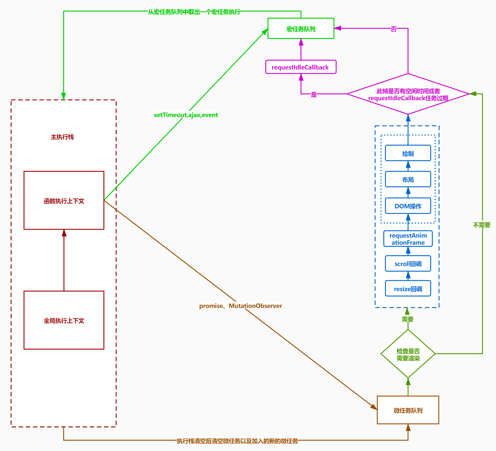
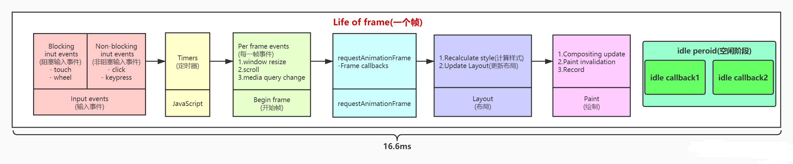
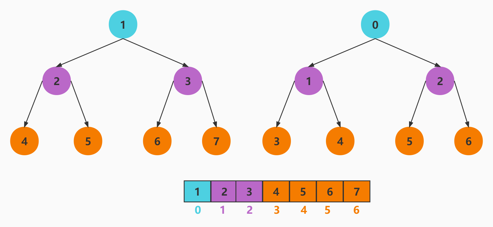

### React 架构

React 16 新的架构分为了三层

- Scheduler（调度器）—— 任务优先级调度，高优任务优先进入 Reconciler
- Reconciler（协调器）—— 负责找出变化的组件、DOMDIFF、触发组件生命周期和副作用及副作用钩子
- Renderer（渲染器）—— 负责将变化的组件渲染到页面上

### Scheduler 调度器

1. 任务优先级调度: React 中的任务通常被称为"工作单元"，它们可以是更新组件状态、处理事件、渲染 UI 等。`Scheduler` **通过根据任务的优先级来调度任务的执行顺序**。例如，对于用户交互产生的事件，`Scheduler` 会赋予更高的优先级，以确保事件处理能够及时响应，提高用户体验。
2. 任务拆分与中断: 为了提高应用的响应性，`Scheduler` 可以**中断**当前正在执行的任务，并切换到更高优先级的任务。此外，`Scheduler` 还可以将一个大任务拆分成多个小任务，使得在每个任务执行间隔中可以执行其他高优先级的任务，从而避免长时间的任务阻塞
3. 时间切片: 将一个连续的任务拆分为多个小片段，每个小片段都在不同的帧中执行。这种时间切片的方式使得 `React` 可以在一帧内完成一部分工作，然后让出主线程给其他任务，从而避免出现长时间的阻塞，提高了应用的响应性
4. 任务调度策略: `Scheduler` 根据当前浏览器环境和设备性能，动态地调整任务调度策略。这意味着在不同的浏览器和设备上，React 可以采用不同的调度策略来获得最佳的性能表现

### 浏览器 EventLoop



### 帧渲染

- 浏览器刷新频率为 60Hz,大概 16.6 毫秒渲染一次，而 JS 线程和渲染线程是互斥的，所以如果 JS 线程执行任务时间超过 16.6ms 的话，就会导致掉帧，导致卡顿. React 利用空闲的时间进行更新，不影响渲染的进行
- 把一个耗时任务切分成一个个小任务，分布在每一帧里的方式就叫时间切片
- 1s 60 帧，所以每一帧分到的时间是 1000/60 ≈ 16 ms,所以我们书写代码时力求不让一帧的工作量超过 16ms



#### 二叉树

- 每个节点最多有两个子节点


#### 满二叉树

- 除最后一层无任何子节点外，每一层上的所有结点都有两个子结点的二叉树


#### 完全二叉树

- 叶子结点只能出现在最下层和次下层
- 且最下层的叶子结点集中在树的左部


#### 最小堆

- 最小堆是一种**经过排序**的完全二叉树
- 其中任一非终端节点的数据值均不大于其左子节点和右子节点的值
- 根节点值是所有堆结点值中最小者
- 编号关系
  - 左子节点编号=父节点编号\*2
  - 右子节点编号=左子节点编号+1
  - 父节点编号=子节点编号除以 2 取整
- 索引关系
  - 左子节点索引=(父节点索引+1)\*2-1
  - 右子节点索引=左子节点索引+1
  - 父节点索引=(子节点索引-1)/2



#### MessageChannel

- 目前 `requestIdleCallback` 浏览器的兼容性不好
- 所以 React 利用 [MessageChannel](https://developer.mozilla.org/zh-CN/docs/Web/API/MessageChannel "MessageChannel") 模拟了 requestIdleCallback，将回调延迟到绘制操作之后执行
- MessageChannel API 允许我们创建一个新的消息通道，并通过它的两个 MessagePort 属性发送数据
- MessageChannel 创建了一个通信的管道，这个管道有两个端口，每个端口都可以通过 postMessage 发送数据，而一个端口只要绑定了 onmessage 回调方法，就可以接收从另一个端口传过来的数据
- MessageChannel 是一个宏任务


```js
// 开启一个新的宏任务
let messageChannel = new MessageChannel();
var port1 = messageChannel.port1;
var port2 = messageChannel.port2;
port1.onmessage = (event) => {
  console.log("port1 接收到了来自port2的数据" + event.data);
};
port2.postMessage("发送给port1的数据");
```

#### MessageChannel

1. react 为啥不用 `requestIdleCallback` 判断浏览器是否有剩余时间作为中断任务的标准，而是实现了 `Scheduler` 调度器 - 为啥要有一个 Scheduler

- 浏览器兼容性
- 触发频率不稳定，受很多因素影响。比如当我们的浏览器切换 tab 后，之前 tab 注册的 `requestIdleCallback` 触发的频率会变得很低

2. react 的时间分片为啥选择使用 MessageChannel

3. Scheduler 和 MessageChannel 的关系

关键点在于 React 执行下一个工作单元之前会调用 `Scheduler.shouldYield()` 询问浏览器是否有剩余时间，如果 `shouldYield` 返回 `true`

- 需要暂停 js 执行，把主线程控制权交还给浏览器，让浏览器有机会更新页面。
- 在下一帧会在申请 5ms 的时间片继续调度任务，执行上次没有执行完的任务。

要满足上面两点需要调度一个宏任务，因为宏任务会在下次 `EventLoop` 事件循环中执行，不会阻塞本次页面更新。而微任务是在本次页面更新前执行。所以使用 `MessageChannel` 的目的是为了产生一个宏任务，为啥不使用 `setTimeout`、 为啥不使用 `requestAnimationFrame(fn)`


### 饥饿问题

### queueMicrotask
- 在源码中的使用 packages\react-reconciler\src\ReactFiberWorkLoop.js -> ensureRootIsScheduled
- 应用场景：同步任务实现批量的回调注册执行

- 将微任务加入队列以在控制返回浏览器的事件循环之前的安全时间执行。
- 微任务是一个简短的函数，它将在当前任务完成其工作后运行，并且在执行上下文的控制权返回到浏览器的事件循环之前没有其他代码等待运行时运行。
- 它让你的代码在运行时不会干扰任何可能具有更高优先级的代码的运行，但在浏览器重新获得对执行上下文的控制之前，这可能取决于你需要完成的工作
