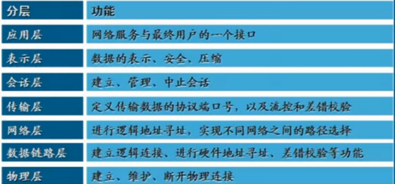
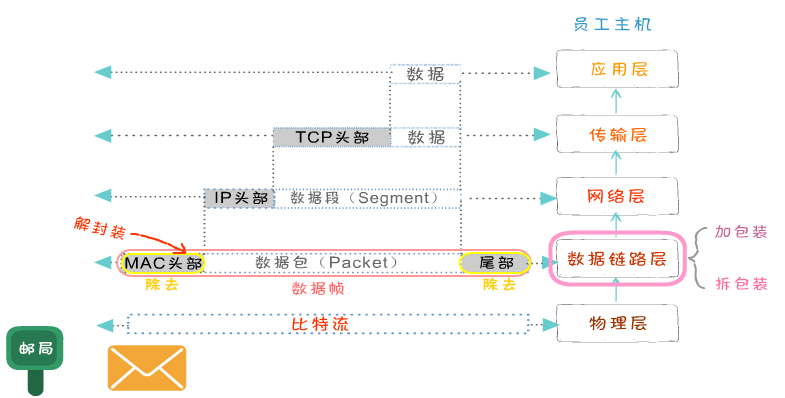
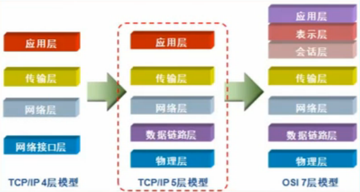
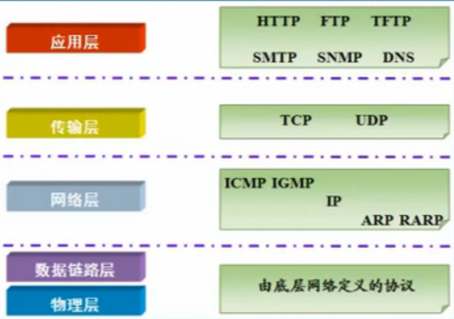
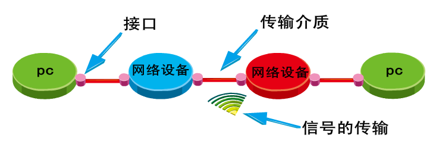
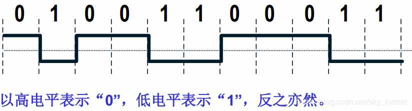

# OSI 七层模型

`Open System Interconnection` 适用于所有的网络

- 分工带来效能
- 将复杂的流程分解为几个功能相对单一的子进程
- 整个流程更加清晰，复杂问题简单化
- 更容易发现问题并针对性的解决问题

  - 应用层(Application) 提供网络与用户应用软件之间的接口服务(HTTP)
  - 表示层(Presentation) 提供格式化的表示和转化数据服务，如加密和压缩
  - 会话层(Session) 提供包括访问验证和会话管理在内的建立和维护应用之间通信的机制
  - 传输层(Transimission) 提供建立、维护和取消传输连接功能，负责可靠的传输数据(TCP)
  - 网络层(Network) 处理网络间路由，确保数据及时传送(路由器) - 网络寻址
  - 数据链路层(DataLink) 负责无错传输数据、确认帧、发错重传等(交换机)
  - 物理层(Physics) 提供机械、电气、功能和过程特性(网卡、网线、双绞线、同轴电缆、中继器)，只关心传输数据0/1,传输的是比特流
  
  七层协议都做了什么？
  - 报文   应用层 + 数据
  - 数据段 传输层 + 数据 + 端口号
  - 数据包 网络层 + 数据 + 端口 + ip地址
  - 数据帧 链路层 + 数据 + 端口 + ip地址(192.168.1.1) + mac地址:原则是唯一的，生产网卡分配的

  ### 1.1 分层模型

  

  ### 1.2 封装过程

  

  ## 2. TCP/IP 参考模型

  - TCP/IP 是传输控制协议/网络互联协议的简称
  - 早期的 TCP/IP 模型是一个四层结构，从下往上依次是网络接口层、互联网层、传输层和应用层
  - 后来在使用过程中，借鉴 OSI 七层参考模型，将网络接口层划分为了物理层和数据链路层，形成五层结构

  

  ### 2.1 协议的概念和作用

  - 为了让计算机能够通信，计算机需要定义通信规则，这些规则就是协议
  - 规则是多种，协议也有多种
  - 协议就是数据封装格式+传输

  ### 2.2 常用协议

  - TCP/IP 协议被称为传输控制协议/互联网协议，又称网络通讯协议
  - 是由网络层的 IP 协议和传输层的 TCP 协议组成，是一个很大的协议集合
  - 物理层和数据链路层没有定义任何特定协议，支持所有的标准和专用的协议

  

  | 层级   | 名称 | 含义                                                                                                                                                                                                                                                                         |
  | ------ | ---- | ---------------------------------------------------------------------------------------------------------------------------------------------------------------------------------------------------------------------------------------------------------------------------- |
  | 应用层 | HTTP | 超文本传输协议（HTTP，HyperText Transfer Protocol)是互联网上应用最为广泛的一种网络协议                                                                                                                                                                                       |
  | 应用层 | FTP  | 文件传输协议（英文：File Transfer Protocol，缩写：FTP）是用于在网络上进行文件传输的一套标准协议，使用客户/服务器模式                                                                                                                                                         |
  | 应用层 | TFTP | (Trivial File Transfer Protocol,简单文件传输协议)是 TCP/IP 协议族中的一个用来在客户机与服务器之间进行简单文件传输的协议                                                                                                                                                      |
  | 应用层 | SMTP | 简单邮件传输协议 (Simple Mail Transfer Protocol, SMTP) 是在 Internet 传输 Email 的事实标准                                                                                                                                                                                   |
  | 应用层 | SNMP | 简单网络管理协议（SNMP，Simple Network Management Protocol），由一组网络管理的标准组成，包含一个应用层协议（application layer protocol）、数据库模型（database schema）和一组资源对象,该协议能够支持网络管理系统，用以监测连接到网络上的设备是否有任何引起管理上关注的情况。 |
  | 应用层 | DNS  | 域名系统（英文：Domain Name System，缩写：DNS）是互联网的一项服务。它作为将域名和 IP 地址相互映射的一个分布式数据库，能够使人更方便地访问互联网。                                                                                                                            |
  |        | TCP  | TCP（Transmission Control Protocol 传输控制协议）是一种面向连接的、可靠的、基于字节流的传输层通信协议                                                                                                                                                                        |
  | 传输层 | UDP  | UDP 是 User Datagram Protocol 的简称， 中文名是用户数据报协议，是 OSI（Open System Interconnection，开放式系统互联） 参考模型中一种无连接的传输层协议，提供面向事务的简单不可靠信息传送服务                                                                                  |
  | 传输层 | ICMP | ICMP（Internet Control Message Protocol）Internet 控制报文协议。它是 TCP/IP 协议簇的一个子协议，用于在 IP 主机、路由器之间传递控制消息。控制消息是指网络通不通、主机是否可达、路由是否可用等网络本身的消息                                                                   |
  | 网络层 | IGMP | Internet 组管理协议称为 IGMP 协议（Internet Group Management Protocol），是因特网协议家族中的一个组播协议。该协议运行在主机和组播路由器之间                                                                                                                                  |
  | 网络层 | IP   | 互联网协议地址（英语：Internet Protocol Address，又译为网际协议地址），缩写为 IP 地址（英语：IP Address），是分配给用户上网使用的网际协议（英语：Internet Protocol, IP）的设备的数字标签                                                                                     |
  | 网络层 | ARP  | 地址解析协议，即 ARP（Address Resolution Protocol），是根据 IP 地址获取物理地址的一个 TCP/IP 协议                                                                                                                                                                            |
  | 网络层 | RARP | 反向地址转换协议（RARP：Reverse Address Resolution Protocol） 反向地址转换协议（RARP）允许局域网的物理机器从网关服务器的 ARP 表或者缓存上请求其 IP 地址                                                                                                                      |

  ## 3. 网络接口层

  - 网络接口层是 TCP/IP 模型的最底层，负责接收从上一层交来的数据报并将数据报通过底层的物理网络发送出去，比较常见的就是设备的驱动程序，此层没有特定的协议
  - 网络接口层又分为物理层和数据链路层

  ### 3.1 物理层

  - 计算机在传递数据的时候传递的都是 0 和 1 的数字，而物理层关心的是用什么信号来表示 0 和 1，是否可以双向通信，最初的连接如何建立以及完成连接如何终止,物理层是为数据传输提供可靠的环境
  - 尽可能的屏蔽掉物理设备和传输媒介，使数据链路层不考虑这些差异，只考虑本层的协议和服务
  - 为用户提供在一条物理传输媒体上提供传送和接收比特流的能力
  - 需要解决物理连接、维护和释放的问题
    

  #### 3.1.1 数字信号的编码

  - 数字信号的编码：用何种物理信号来表示 0 和 1

  ##### 3.1.1.1 非归零编码

  

  - 优点： 编/译码简单。
  - 缺点： 内部不含时钟信号， 收/发端同步困难。
  - 用途： 计算机内部， 或低速数据通信

  #### 3.1.1.2 曼彻斯特编码

  - 优点：
    - 内部自含时钟， 收/发端同步容易。
    - 抗干扰能力强。
  - 缺点：
    - 编/译码较复杂。
    - 占用更多的信道带宽， 在同样的波特率的情况下， 要比非归零编码多占用一倍信道带宽。
    - 用途： 802.3 局域网（以太网）

  ### 3.2 数据链路层

  - 数据链路层是 OSI 参考模型中的第二层，介乎于物理层和网络层之间
  - 数据链路层在物理层提供的服务的基础上向网络层提供服务，其最基本的服务是将源自网络层来的数据可靠地传输到相邻节点的目标机网络层
  - 如何将数据组合成数据块，在数据链路层中称这种数据块为帧 frame，帧是数据链路层的传送单位
  - 如何控制帧在物理信道上的传输，包括如何处理传输差错，如何调节发送速率以使与接收方相匹配
  - 以及在两个网络实体之间提供数据链路通路的建立、维持和释放的管理

  #### 3.2.1 以太网

  - 以太网（Ethernet）是一种计算机局域网技术。IEEE 组织的 IEEE 802.3 标准制定了以太网的技术标准，它规定了包括物理层的连线、电子信号和介质访问层协议的内容
  - 以太网的标准拓扑结构为总线型拓扑
  - 以太网仍然使用总线型拓扑和 CSMA/CD（Carrier Sense Multiple Access/Collision Detection，即载波多重访问/碰撞侦测）的总线技术
  - 以太网实现了网络上无线电系统多个节点发送信息的想法，每个节点必须获取电缆或者信道的才能传送信息
  - 每一个节点有全球唯一的 48 位地址也就是制造商分配给网卡的 MAC 地址，以保证以太网上所有节点能互相鉴别
