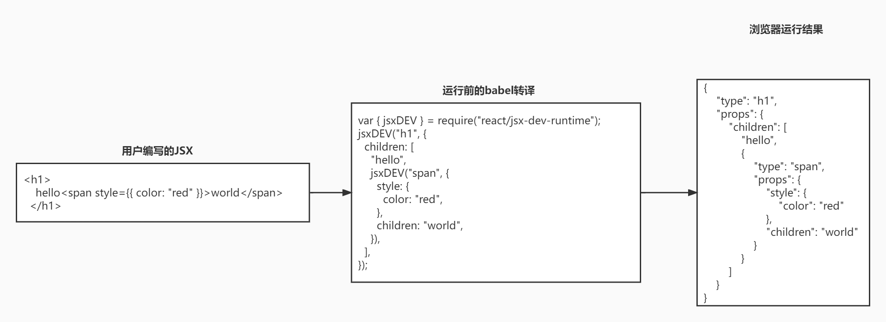
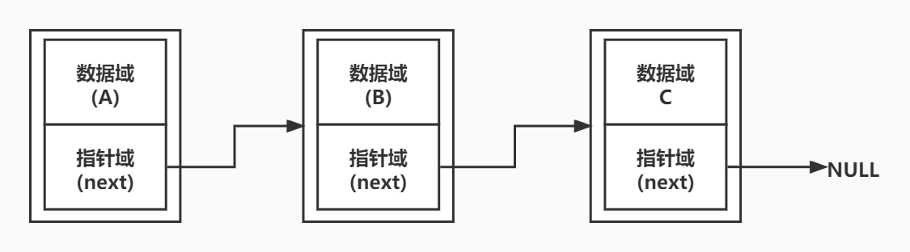
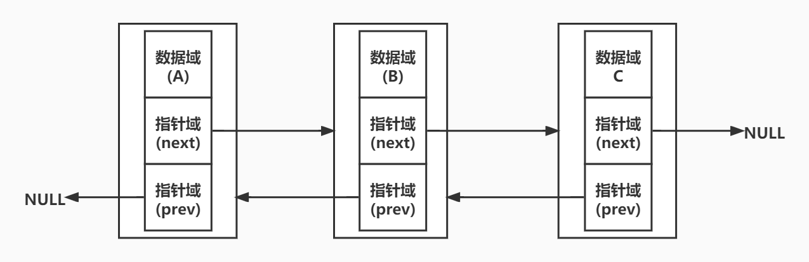
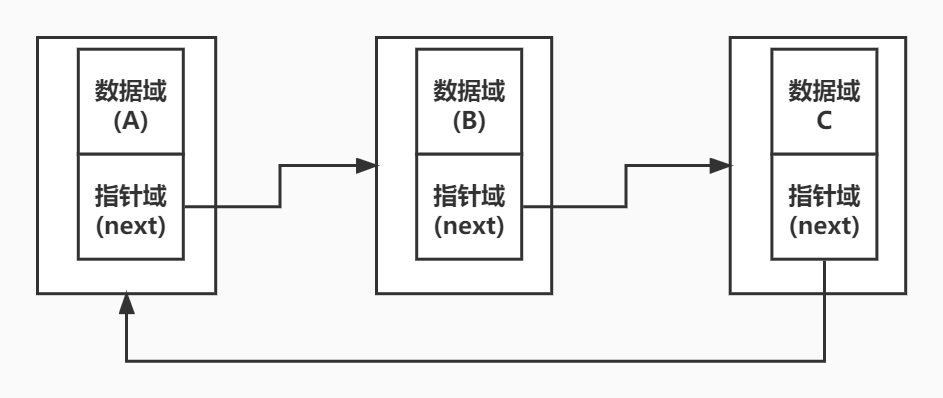
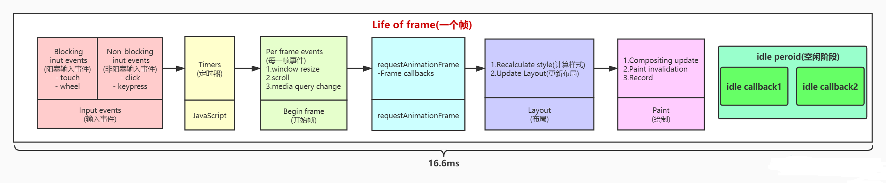
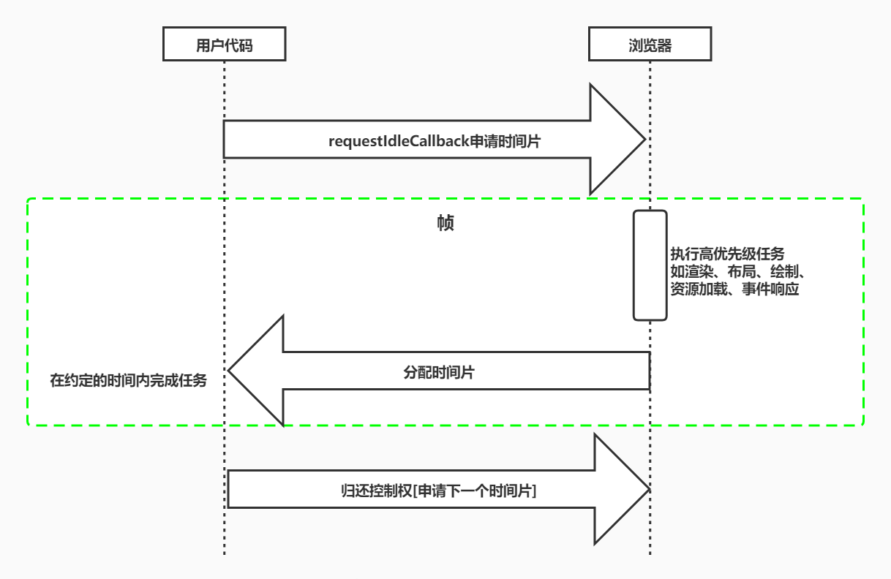
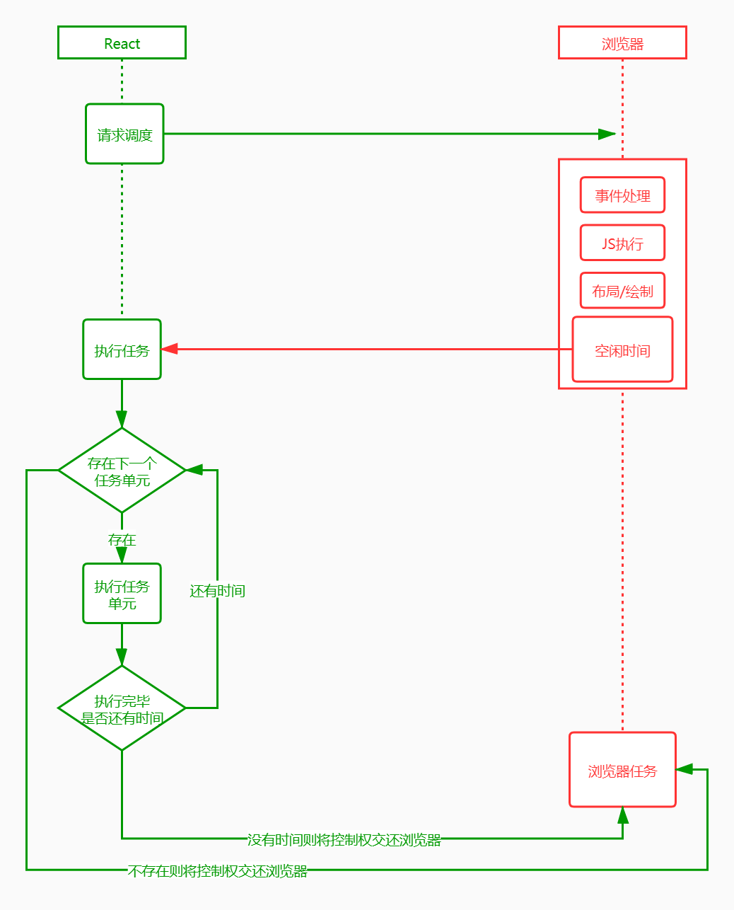
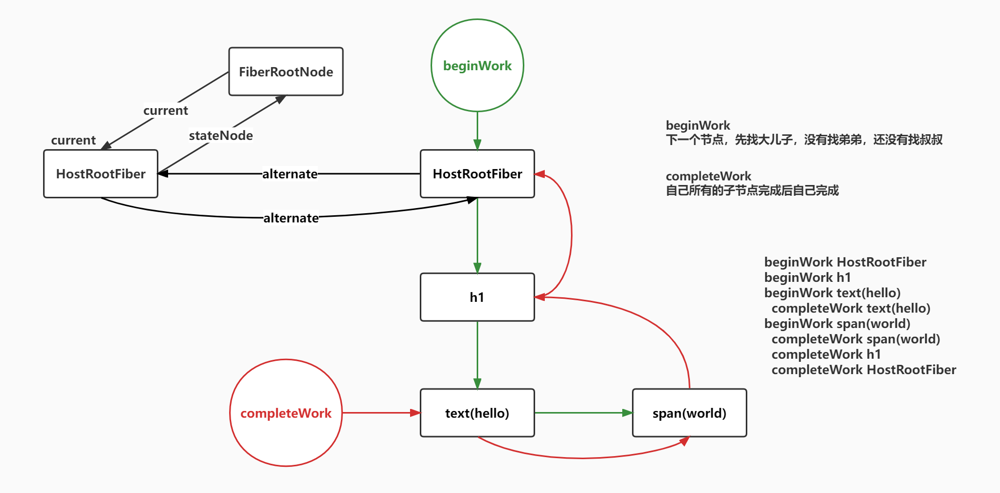
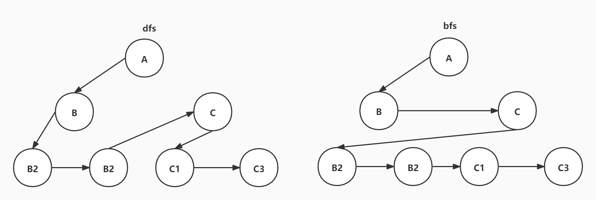
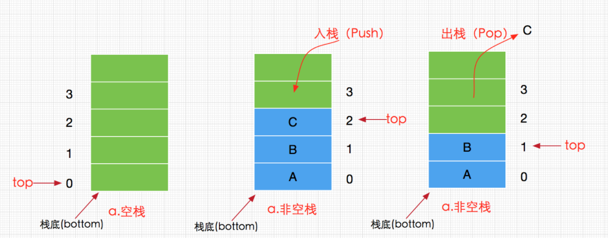

1. 中断后怎么找到继续从哪里开始执行

#### 1.1 React 是什么?

- `React` 是一个用于构建用户界面的 JavaScript 库
- 可以通过组件化的方式构建快速响应的大型 `Web` 应用程序

#### 1.2 JSX 是什么

- [JSX](https://zh-hans.reactjs.org/docs/introducing-jsx.html "jsx简介") 是一个 `JavaScript` 的语法扩展,JSX 可以很好地描述 UI 应该呈现出它应有交互的本质形式. 在运行前会经过 babel 转译，
- [repl](https://babeljs.io/repl "在线转换代码") 可以在线转换代码

  ```js
  // react17以前旧的转换
  const babel = require("@babel/core");
  const sourceCode = `
  <h1>
      hello<span style={{ color: "red" }}>world</span>
  </h1>
  `;
  const result = babel.transform(sourceCode, {
    plugins: [["@babel/plugin-transform-react-jsx", { runtime: "classic" }]],
  });
  console.log(result.code);

  // 转译后的结果
  /*#__PURE__*/ React.createElement(
    "h1",
    null,
    "hello ",
    /*#__PURE__*/ React.createElement(
      "soan",
      {
        style: {
          color: "red",
        },
      },
      "world"
    )
  );
  ```

  ```js
  // 新的转换
  const babel = require("@babel/core");
  const sourceCode = `
  <h1>
      hello<span style={{ color: "red" }}>world</span>
  </h1>
  `;
  const result = babel.transform(sourceCode, {
    plugins: [["@babel/plugin-transform-react-jsx", { runtime: "automatic" }]],
  });
  console.log(result.code);
  // 转译后的结果 由内而外执行 深度优先
  import { jsxDEV } from "react/jsx-dev-runtime";
  jsxDEV("h1", {
    children: [
      "hello",
      jsxDEV("span", {
        style: {
          color: "red",
        },
        children: "world",
      }),
    ],
  });
  ```

- [astexplorer](https://astexplorer.net "astexplorer") 可以把代码转换成 AST 树
- `react/jsx-runtime` 和 `react/jsx-dev-runtime` 中的函数只能由编译器转换使用。如果你需要在代码中手动创建元素，你可以继续使用 `React.createElement`

#### 1.3 Virtual DOM

- `React.createElement` 函数所返回的就是一个虚拟 DOM
- 虚拟 DOM 就是一个描述真实 DOM 的纯 JS 对象, 虚拟 DOM 会在内存中构建出对应的 fiber 树结构
- 虚拟 DOM 是一个对象， fiber 是一个链表



#### 1.4

##### 1.4.1 链表分类

###### 1.4.1.1 单向链表



###### 1.4.1.2 双向链表



###### 1.4.1.3 循环链表



#### 1.5 fiber

为什么 fiber 数据结构可以中断，原来的虚拟 dom 接口不可中断呢

##### 1.5.1 性能瓶颈

- JS 任务执行时间过长
  - 浏览器刷新频率为 60Hz,大概 16.6 毫秒渲染一次，而 JS 线程和渲染线程是互斥的，所以如果 JS 线程执行任务时间超过 16.6ms 的话，就会导致掉帧，导致卡顿，解决方案就是 React 利用空闲的时间进行更新，不影响渲染进行的渲染
- 把一个耗时任务切分成一个个小任务，分布在每一帧里的方式就叫时间切片

##### 1.5.2 屏幕刷新频率

- 目前大多数设备的屏幕刷新率为 60 次/秒
- 浏览器渲染动画或页面的每一帧的速率也需要跟设备屏幕的刷新率保持一致
- 页面是一帧一帧绘制出来的，当每秒绘制的帧数（FPS）达到 60 时，页面是流畅的,小于这个值时，用户会感觉到卡顿
- 每个帧的预算时间是 16.66 毫秒 (1 秒/60)
- 1s 60 帧，所以每一帧分到的时间是 1000/60 ≈ 16 ms,所以我们书写代码时力求不让一帧的工作量超过 16ms

##### 1.5.3 帧

- 每个帧的开头包括样式计算、布局和绘制
- JavaScript 执行 Javascript 引擎和页面渲染引擎在同一个渲染线程,GUI 渲染和 Javascript 执行两者是互斥的
- 如果某个任务执行时间过长，浏览器会推迟渲染
  

##### 1.5.4 requestIdleCallback

- 我们希望快速响应用户，让用户觉得够快，不能阻塞用户的交互
- `requestIdleCallback` 使开发者能够在主事件循环上执行后台和低优先级工作，而不会影响延迟关键事件，如动画和输入响应
- 正常帧任务完成后没超过 16 ms,说明时间有富余，此时就会执行 `requestIdleCallback` 里注册的任务

react 并没有使用 `requestIdleCallback` API, 因为这个时间完全不可控，剩余时间由浏览器决定，而且存在兼容性问题。react 固定了每帧的空闲时间为 5ms。而且一个任务就是一个 fiber 单元，也就是最小执行单元无法被中断。



##### 1.5.5 fiber

> 一个任务的执行单元要拆多细呢？这就引入了 fiber 的概念

- 我们可以通过某些调度策略合理分配 CPU 资源，从而提高用户的响应速度
- 通过 Fiber 架构，让 react 的调和过程变成可被中断。 适时地让出 CPU 执行权，除了可以让浏览器及时地响应用户的交互

###### 1.5.5.1 Fiber 是一个执行单元

- Fiber 是一个执行单元,每次执行完一个执行单元, React 就会检查现在还剩多少时间，如果没有时间就将控制权让出去
  

###### 1.5.5.2 Fiber 是一个数据结构

虚拟 DOM 在内存中构建的一个链表结构

- React 目前的做法是使用链表, 每个虚拟节点内部表示为一个 Fiber
- 从顶点开始遍历
- 如果有第一个儿子，先遍历第一个儿子
- 如果没有第一个儿子，标志着此节点遍历完成
- 如果有弟弟遍历弟弟
- 如果有没有下一个弟弟，返回父节点标识完成父节点遍历，如果有叔叔遍历叔叔
- 没有父节点遍历结束


###### 1.5.5.3 递归构建 fiber 树



#### 1.6 树的遍历

##### 1.6.1 深度优先(DFS)

- 深度优先搜索英文缩写为 DFS 即 `Depth First Search`
- 其过程简要来说是对每一个可能的分支路径深入到不能再深入为止，而且每个节点只能访问一次
- 应用场景
  - React 虚拟 DOM 的构建
  - React 的 fiber 树构建



##### 1.6.2 广度优先(BFS)

- 广度优先搜索算法，其英文全称是 Breadth First Search
- 算法首先搜索距离为 k 的所有顶点，然后再去搜索距离为 k+l 的其他顶点


##### 1.6.3 栈

- 栈（stack）又名堆栈，它是一种运算受限的线性表
- 限定仅在表尾进行插入和删除操作的线性表，这一端被称为栈顶，相对地，把另一端称为栈底
- 向一个栈插入新元素又称作进栈、入栈或压栈，它是把新元素放到栈顶元素的上面，使之成为新的栈顶元素
- 从一个栈删除元素又称作出栈或退栈，它是把栈顶元素删除掉，使其相邻的元素成为新的栈顶元素
  

#### 4.创建 ReactDOMRoot

#### 对节点 DIFF

- DOM DIFF 的三个规则
  - 只对同级元素进行比较，不同层级不对比
  - 不同的类型对应不同的元素
  - 可以通过 key 来标识同一个节点
- 第 1 轮遍历
  - 如果 key 不同则直接结束本轮循环
  - newChildren 或 oldFiber 遍历完，结束本轮循环
  - key 相同而 type 不同，标记老的 oldFiber 为删除，继续循环
  - key 相同而 type 也相同，则可以复用老节 oldFiber 节点，继续循环
- 第 2 轮遍历
  - newChildren 遍历完而 oldFiber 还有，遍历剩下所有的 oldFiber 标记为删除，DIFF 结束
  - oldFiber 遍历完了，而 newChildren 还有，将剩下的 newChildren 标记为插入，DIFF 结束
  - newChildren 和 oldFiber 都同时遍历完成，diff 结束
  - newChildren 和 oldFiber 都没有完成，则进行节点移动的逻辑
- 第 3 轮遍历
  - 处理节点移动的情况

#### useEffect

- 在函数组件主体内（这里指在 React 渲染阶段）改变 DOM、添加订阅、设置定时器、记录日志以及执行其他包含副作用的操作都是不被允许的，因为这可能会产生莫名其妙的 bug 并破坏 UI 的一致性
- 使用 useEffect 完成副作用操作。赋值给 useEffect 的函数会在组件渲染到屏幕之后执行。你可以把 effect 看作从 React 的纯函数式世界通往命令式世界的逃生通道
- useEffect 就是一个 Effect Hook，给函数组件增加了操作副作用的能力。它跟 class 组件中的 componentDidMount、componentDidUpdate 和 componentWillUnmount 具有相同的用途，只不过被合并成了一个 API
- 该 Hook 接收一个包含命令式、且可能有副作用代码的函数
